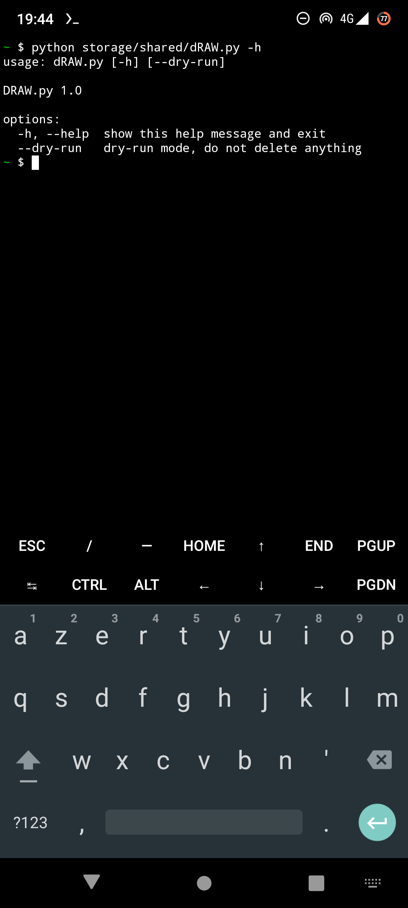
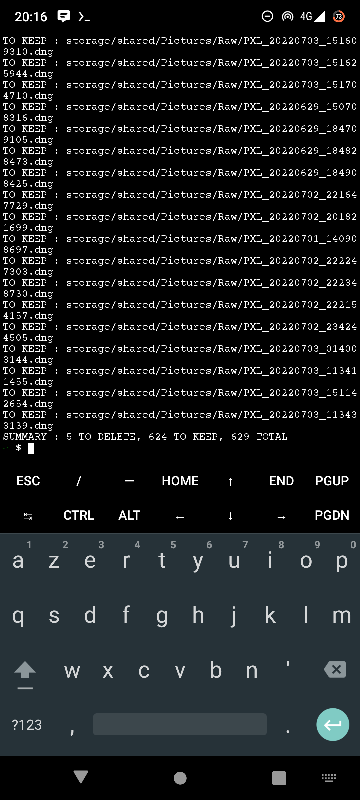

# dRAW.py

## About
Remove orphan GCam .DNG files that don't have corresponding / matching .JPG file on Android.
Useful if you shoot RAW+JPG with Google Camera, review and delete the JPG, then want to delete the RAW counterparts.

| Display dRAW.py help : `-h` | Preview deletion result : `--dry-run` |
|:-:|:-:|
|  |  |

:warning: Use at your own risk.

## Initial setup
1. Setup Termux on your Android phone : https://termux.com/
	- F-Droid : https://f-droid.org/en/packages/com.termux/
	- GitHub : https://github.com/termux/termux-app/releases
2. Start Termux
3. Execute command `termux-setup-storage` to grant access to shared storage (see [Termux : Setup storage](https://wiki.termux.com/wiki/Termux-setup-storage))
4. Execute command `pkg install python` to install latest Python package (see [Termux : Python](https://wiki.termux.com/wiki/Python))
5. Copy `dRAW.py` file to your `~/storage/shared` shared storage (see [Termux : Setup storage](https://wiki.termux.com/wiki/Termux-setup-storage))
6. Edit default extensions and paths (optional) :
```python
RAW_EXTENSION = "dng"
JPG_EXTENSION = "jpg"
RAW_DIRECTORY_PATH = r"shared/Pictures/Raw"
JPG_DIRECTORY_PATH = r"shared/DCIM/Camera"
```

## Usage
1. Execute command `python storage/shared/dRAW.py -h` to display help
2. Execute command `python storage/shared/dRAW.py --dry-run` to preview deletion result
3. Execute command `python storage/shared/dRAW.py` to delete orphan .DNG files

## Requirements
- Android >= 7
- No root required
- No custom ROM required

## License
dRAW.py is released under the [GNU General Public License v3.0](https://www.gnu.org/licenses/gpl-3.0.fr.html).
